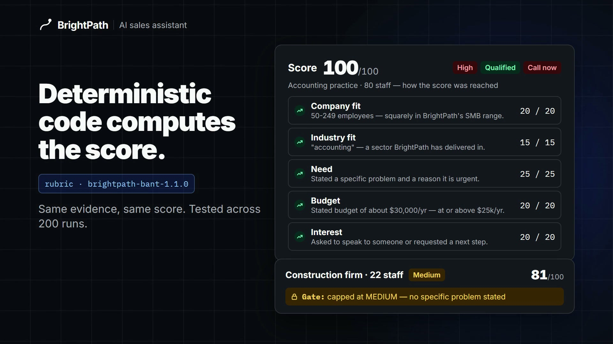
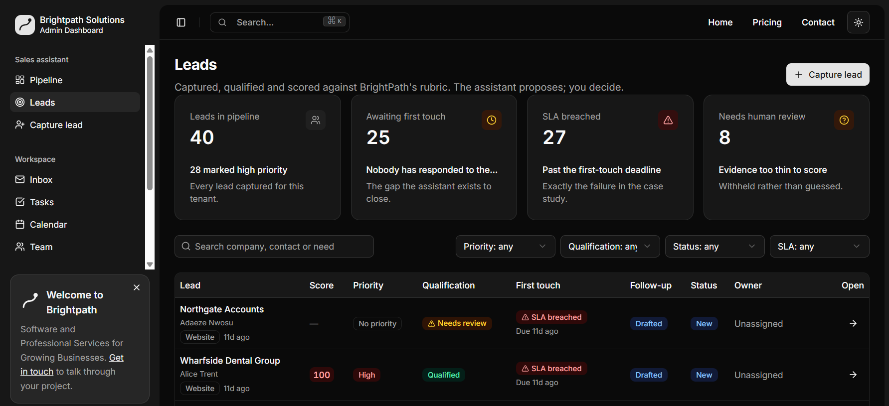

# BrightPath — AI Sales Assistant

[](https://github.com/Kikobazz123/lordgen-brightpath-dashboard/actions/workflows/ci.yml)

A sales assistant for **BrightPath Solutions**, a firm selling software and
professional services to small and mid-sized businesses. Leads arrive from five
channels and none of those channels is a queue, so the expensive ones go cold
unnoticed.

A lead arrives, is captured, analysed, scored against an explicit written rubric,
given a drafted follow-up and one recommended next action — then tracked through a
status a human still owns.

**Live → <https://brightpath-dashboard.vercel.app>** — the sign-in arrives
pre-filled, so it is one button press. No credentials to be told, none to invent.

Built by **[Lordmark Dorgu](https://github.com/Kikobazz123)** for AI BuildFest 2026 ·
Track 1, Case Study 2 · BuildFest ID BF-0976

[](docs/video/demo.mp4)

*32-second walkthrough (click to play). Below: the live leads workspace.*



**Stack:** Next.js 16 (App Router) · React 19 · TypeScript · Tailwind CSS 4 + shadcn/ui ·
Neon Postgres via Drizzle ORM · Zod · Gemini / Groq / OpenRouter / Anthropic with
failover · Nodemailer (Gmail SMTP) · Vitest · GitHub Actions · Vercel

---

## See it in five minutes

| Go here | What it shows |
|---|---|
| [`/landing`](https://brightpath-dashboard.vercel.app/landing) | BrightPath's own marketing site, and the public capture form a real lead would arrive through |
| [`/dashboard`](https://brightpath-dashboard.vercel.app/dashboard) | Pipeline tiles, the work queue, and the first-touch SLA clock |
| [`/leads`](https://brightpath-dashboard.vercel.app/leads) | The triage list, with filters held in the URL so a view is shareable |
| [`/leads/new`](https://brightpath-dashboard.vercel.app/leads/new) | Capture a lead and watch the assistant run on it |
| [`/api/v1/health`](https://brightpath-dashboard.vercel.app/api/v1/health) | Whether the database and the AI provider are actually up |

The sign-in is a **presentation gate, not authentication** — nothing is checked and
no account is created. It exists so a visitor meets the product before the dashboard,
not to keep anyone out. The real boundary is a bearer token on every API call plus
tenant scoping on every query, and that is unchanged by it.

---

## The decision everything rests on

**The model extracts evidence. Deterministic code computes the score.**

The analyst reports facts, each carrying the verbatim quote it came from. The rubric
in [`src/lib/pipeline/rubric.ts`](src/lib/pipeline/rubric.ts) applies policy to those
facts. The model has **never been told what a good lead looks like**, because telling
it would invite it to flatter whichever lead it happens to be reading.

```
The analyst reports FACTS  — "they have 40 staff", "they said £20k"
The rubric applies POLICY  — "40 staff is our sweet spot", "£20k clears"
```

This is why the same evidence scores identically across runs, why every point traces
to a named rubric line, and why the build is nearly free to run.

The rubric follows BANT, versioned `brightpath-bant-1.1.0`, weighted to 100:

| Signal | Points |
|---|---|
| Need | 25 |
| Company fit | 20 |
| Budget | 20 |
| Interest | 20 |
| Industry fit | 15 |

Three **gates** sit alongside the weighted total, because some facts are worth a
verdict rather than points — a weighted sum will happily let four good signals
outvote one fatal one:

- An explicit *"we have no budget"* disqualifies outright, whatever else is true.
- HIGH priority requires an **explicitly stated problem**. "We know we're behind on
  tech" is an admission, not a requirement — capped at MEDIUM.
- HIGH priority requires a **stated figure**. A perfect problem in a perfect sector
  with an eager tone reaches 80 without anyone naming a number: worth working, not
  worth dropping a confirmed-budget lead for.

Policy changes belong in `rubric.ts` with a version bump. **Never move scoring into a
prompt** — a prompt cannot be diffed, reviewed, or reproduced.

---

## The other rule: no claim without proof

The product exists because leads go cold unnoticed, so the one thing it must never do
is look confident about something it does not know.

- A signal with no verbatim quote is reported **absent, not guessed**. Claims whose
  quote cannot be found in the source text are dropped.
- A score is **withheld — `null`, rendered as an em dash** — when required evidence is
  missing. Never zero, which is a judgement rather than the absence of one.
- `median_first_touch_minutes` is `null` until something is touched. "No data" and
  "instant response" must not share a glyph.
- **There is no send button.** The only route to `sent` is recording a real provider
  message id. A button that flipped a column would be the most damaging lie this app
  could tell.
- With no provider configured the pipeline degrades to a labelled stub and returns
  `NEEDS_REVIEW` rather than inventing evidence — and `/api/v1/health` reports itself
  `degraded` instead of pretending to be fine.

---

## Architecture

One Next.js 16 application holds both the API and the interface.

```
capture → intake → analyst → scoring/rubric → writer → advisor → status
          (code)   (model)      (code)        (model)  (model)   (human)
```

- **Framework** — Next.js 16 App Router, React 19 Server Components, TypeScript.
- **Data** — Neon serverless Postgres via Drizzle, with Zod contracts in
  `src/lib/contracts/` shared by HTTP routes and Server Components alike, so both
  validate against one definition.
- **API** — 12 routes plus health under `/api/v1`: leads list/create/import, lead
  detail, analyze, score, follow-up, confirm-send, next-action, status, activity,
  stats, and per-source webhooks.
- **AI** — provider-agnostic (`src/lib/ai/provider.ts`) with a failover chain,
  `gemini → groq → openrouter → stub`. Each request walks the chain independently,
  and it **advances on any provider failure, not only rate limits** — learned when a
  retired model name returned a non-retryable 404 and a healthy second provider sat
  unused.
- **Observability** — every request logs one structured JSON line and returns an
  `x-request-id`, so a specific failure is findable by id.

---

## Tests

```bash
pnpm test                # Vitest: rubric, gates, evidence contract, draft routing,
                         # provider failover, intake and the SLA clock
pnpm lint
pnpm typecheck
```

The unit tests need no database, network or API key, and CI runs all three on every
push. The rubric's claims are the ones a sceptical reader should check, so they are
tests rather than README assertions: identical evidence scores identically across 200
runs, order does not matter, every point traces to a named rubric line, and a value
without a quoted source fails the contract.

Integration checks that need real infrastructure stay as scripts:

```bash
pnpm verify              # the pure suites as scripts (scoring + failover)
pnpm verify:journey      # 20 checks against a real database, self-cleaning
pnpm verify:provider     # one real AI call; exits non-zero if it hit the stub
```

`verify:journey` covers capture, the pipeline, truthfulness of follow-up state, the
SLA clock, the audit trail, and four cross-tenant access checks. It creates a
throwaway tenant and deletes it, so it is safe to run against the demo database.

---

## Running it locally

```bash
pnpm install
cp .env.example .env.local   # then fill it in
pnpm db:push                 # apply the schema
pnpm db:seed                 # demo leads
pnpm dev                     # serves on $BASE_URL (default in .env.example)
```

It runs with **no API key at all** — leave `AI_PROVIDER="stub"` and the whole journey
still works end to end, returning clearly-labelled placeholder output. Add a free
[Gemini key](https://aistudio.google.com/apikey) when you want real extraction.

Every variable is documented with placeholders in [`.env.example`](.env.example);
deployment, the environment-variable table and the failover reasoning are in
[`DEPLOYMENT.md`](DEPLOYMENT.md). `.env.local` holds real values and is gitignored.

---

## What's in this repo

| Path | What it is |
|---|---|
| `src/app/api/v1/` | The API |
| `src/app/(dashboard)/leads/` | The leads workspace — triage, detail, capture |
| `src/app/landing/` | BrightPath's marketing site and the public capture form |
| `src/lib/pipeline/` | Intake, analyst, rubric, scoring, writer, advisor |
| `brief/` | The governing brief the build was judged against |
| `docs/submission/` | Judges walkthrough, pitch deck, project links, summary |
| `HANDOFF.md` | Project status, and the history behind the shape of the repo |

One note that saves a wrong turn:

- **[`lordgen-brightpath-backend`](https://github.com/Kikobazz123/lordgen-brightpath-backend)
  is a frozen snapshot** of the first build session, kept as a record. This repo
  started from that backend and has reworked it since (auth, rate limiting,
  mail, failover, the leads UI). Do not develop there.

---

## Licensing — read before reusing anything

This repository contains two kinds of code with two different owners.

- **The UI scaffolding is MIT**, from
  [`shadcnstore/shadcn-dashboard-landing-template`](https://github.com/shadcnstore/shadcn-dashboard-landing-template)
  (nextjs-version) — the shadcn/ui components, layout chrome, auth and error shells,
  and the showcase screens that are not part of the leads workspace.
- **The BrightPath application is not licensed for reuse.** Everything written for
  BrightPath Solutions is © 2026 the repository owner, all rights reserved.

Full terms, and the unaltered MIT notice, in [`License.md`](License.md).

---

Built by **Lordmark Dorgu** in Claude Code. Shipped on Vercel.
